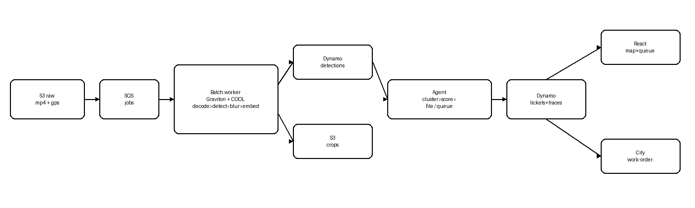

# CivicLens — Technical Report

> Status: living document. Numbers below are measured (commands to reproduce
> inline); sections marked TODO need filming/RDD2020/AWS access.

## 1. Problem & Impact
TODO (needs city data): pothole backlog statistics, patrol cost baseline.

## 2. Users & Buyer
Buyer: city works department. Users: road crews (CSV/webhook work orders),
review operators (amber queue), citizens (indirect). Pilot offer: one ward,
one fleet, four weeks, measured before/after. TODO: persona table from PRD.

## 3. Architecture
 (source: `arch_diagram.mmd`, PRD Appendix A).
S3 raw → SQS jobs → Graviton/CPU batch worker (decode→detect→blur→embed) →
DynamoDB detections + S3 crops → agent (cluster→score→file/queue) →
DynamoDB tickets + traces → React map/queue → CSV/webhook work orders.
Human override flows back into the agent with full trace.

## 4. OpenCV 5 Implementation
- `vision/detector.py`: YOLOv8n (conf 0.25, NMS 0.5, min-box 24px) fused with
  Canny+contour fallback (area>500, aspect 0.3–3.0); overlap boosts +0.1,
  large classical-only regions enter at 0.45; borderline band gets ROI re-check.
- `vision/classical.py`: blur→Canny(50/150)→dilate→RETR_EXTERNAL + perspective
  area (y-depth normalized) + center-lane check.
- `vision/embedder.py`: ORB-500 mean → 128-d unit norm (blank→zero vector);
  inputs capped at 128px (11.5→1.8ms/crop, quality identical — `docs/PERF.md`).
- `vision/blur.py`: Haar face + plate cascades (fetched at build; pip wheels
  ship empty data dirs), plate edge-density fallback, odd-strength guard.
- Measured on ARM Ampere (YOLOv8n, 2 vCPU): 356ms/frame. Classical-only
  key-frame eval: P=0.29 R=0.50 (`python eval/eval_detector.py`) — the fallback
  path, not the fused system; YOLO numbers need pothole-trained weights.

## 5. AWS Deployment
TODO (needs credentials): `infra/scripts/setup-aws.sh` provisions S3 (SSE-S3,
14-day raw lifecycle) + 3 DynamoDB tables (GSIs, 90-day detection TTL) + SQS.
Local mirror: `docker compose up` (localstack S3+SQS :4566, dynamodb-local
:8100). IAM: ward-scoped prefixes documented at deploy (TODO).

## 6. Agentic Loop
perceive (cluster detail log) → decide (70/40 gates, arterial ≥85 forced
review) → act (file + webhook / queue / dismiss) → store (DynamoDB + trace).
Example — auto-filed ticket trace (real run, `TraceLogger.export_trace_jsonl`):
```jsonl
{"actor": "agent", "from_status": "new", "reasons": ["severity 73 >= 70"], "signals": {"area_norm": 46.1, "bus_route_w": 100.0, "center_lane": 100.0, "repeat": 100.0}, "to_status": "filed", "ts": "2026-10-09T18:31:56Z"}
```
Human override (same mechanism, `actor: human`):
```jsonl
{"actor": "human", "from_status": "pending", "reasons": ["confirmed on site"], "signals": {}, "to_status": "filed", "ts": "2026-10-10T00:00:00Z"}
```
Controls: override guard on exported tickets, threshold-adjustment logging
(future), arterial forced-review rule (implemented + tested).

## 7. COOL Benchmark
Stock-OpenCV baseline, demo clip (960×540 h264, 60s), decode→classical→ORB:
| Metric | x86 dev (16c) | ARM Ampere (2c) | Graviton+COOL c7g |
|---|---|---|---|
| Throughput (sampled) | 146.9 fps | 90.0 fps | TBD |
| Latency p95 | 2.3ms | 2.5ms | TBD |
| CPU% | 77% | 71% | TBD |
Reproduce: `make bench`. Full COOL comparison needs c7g access (see `cool_appendix.md`).

## 8. Evaluation Results
- Dedup (`python eval/eval_dedup.py`): **80 → 9 (8.89×, −88.8%), precision 1.00,
  recall 0.88** (one GPS-drift split, documented in `failure_cases/`).
- Severity (`python eval/eval_severity.py`): **Spearman rho=1.00 ≥ 0.70 PASS**
  (rank perfect; absolute calibration skews low on synthetic data).
- Detector: classical P=0.29 R=0.50 (fallback only); YOLO P/R needs weights + RDD2020.
- Full suite: 55 passed + hardening tests (`make test`).

## 9. Failure Cases
See `eval/failure_cases/README.md`: night drop, rain glare, speed breakers, tar
patches (expected, need real footage) + GPS-drift split (measured).

## 10. Responsible Use
Faces/plates blurred before storage; raw 14-day retention; detections TTL 90
days; SSE-S3; HMAC webhooks; 15-min presigned URLs; CORS allowlist via
`CORS_ORIGINS`; advisory ("verify on site") — no auto-dispatch; human override
always available.

## 11. Reproducibility
`docker compose up --build` → `make seed-demo` → http://localhost:3000.
`make bench`, `make test`, `make secrets`. Deps: `requirements.lock` (freeze
due Oct 17).
